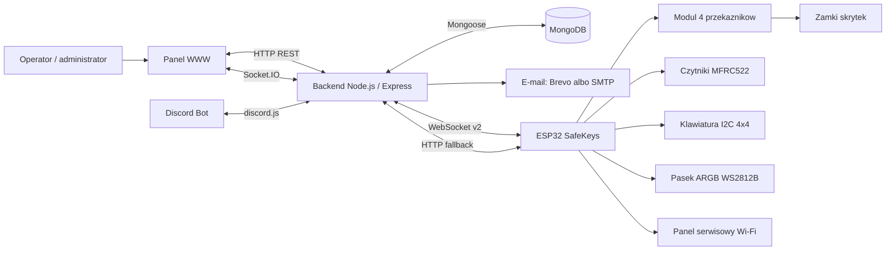
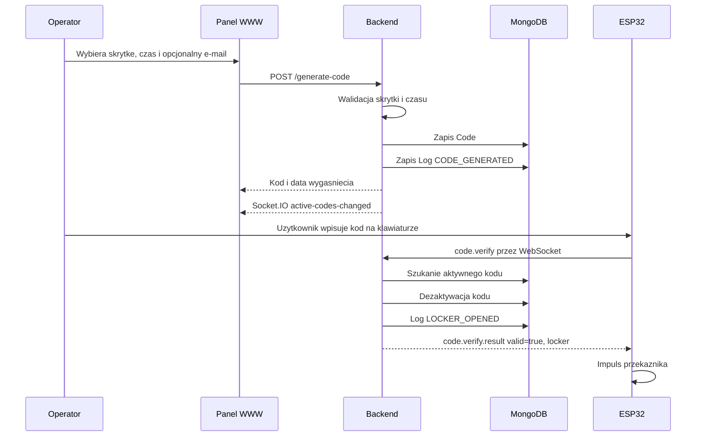
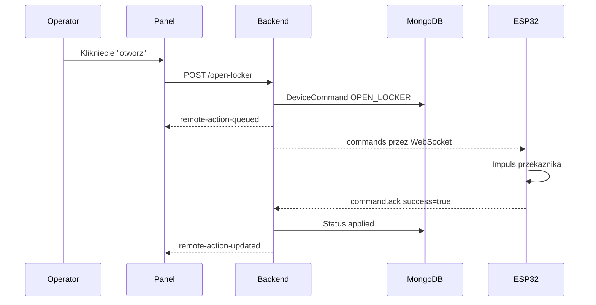
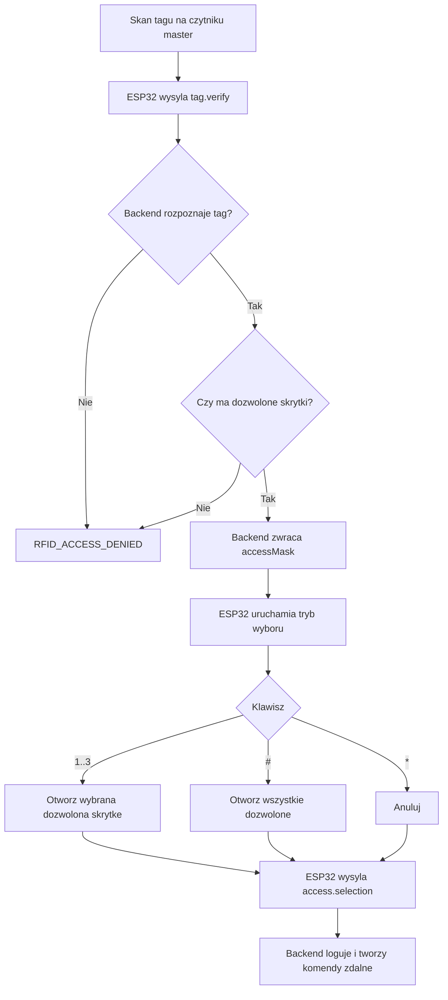
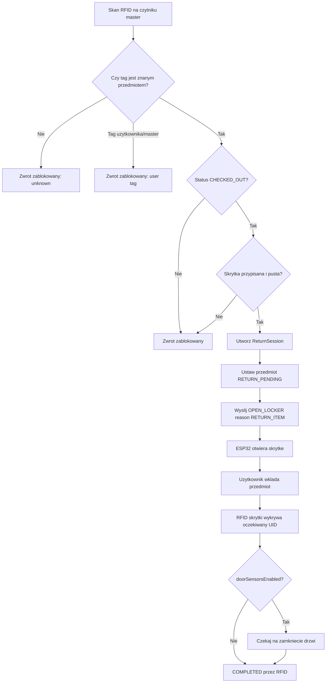

# Dokumentacja techniczna systemu SafeKeys

Stan analizy: 2026-06-09  
Repozytorium: `locker-system`  
Zakres: oprogramowanie serwerowe, panel WWW, firmware ESP32, protokoly komunikacyjne, modele danych, testy oraz konfiguracja sprzetowa widoczna w kodzie.

> Uwaga metodyczna: dokument powstal na podstawie analizy plikow znajdujacych sie w repozytorium. Elementy, ktorych nie da sie jednoznacznie potwierdzic z kodu, oznaczono jako `wymaga potwierdzenia`. Dokument celowo nie zawiera rzeczywistych sekretow, tokenow, hasel, adresow prywatnych ani kluczy API.

## 1. Wprowadzenie

SafeKeys jest systemem zarzadzania skrytkami, ktory laczy aplikacje serwerowa Node.js, panel administracyjny WWW oraz firmware dla mikrokontrolera ESP32. System obsluguje otwieranie skrytek kodami PIN, autoryzacje RFID, zdalne polecenia operatorskie, logowanie zdarzen, monitoring stanu urzadzenia oraz proces zwrotu przedmiotow przy uzyciu czytnika glownego RFID.

Glowny przypadek uzycia to szafka lub zestaw skrytek, w ktorych uzytkownik moze:

- odebrac przedmiot po wpisaniu jednorazowego kodu,
- uzyskac dostep karta lub brelokiem RFID,
- zwrocic przedmiot przez skan RFID na czytniku glownym,
- skorzystac z obslugi operatora przez panel administracyjny.

System jest podzielony na trzy warstwy:

- backend z baza MongoDB, logika biznesowa, autoryzacja, WebSocket i REST API,
- frontend jako statyczny panel WWW obslugiwany z tego samego serwera,
- firmware ESP32 sterujacy przekaźnikami, czytnikami RFID, klawiatura, LED ARGB i lokalnym panelem serwisowym.

W aktywnej konfiguracji kodowej system obsluguje 3 logiczne skrytki, przy czym firmware posiada konfiguracje 4 kanalow przekaznikowych.

## 2. Zalozenia projektowe

Najwazniejsze zalozenia wynikajace z kodu:

- system ma dzialac jako polaczenie panelu operatora i urzadzenia fizycznego ESP32,
- komunikacja z ESP32 ma byc przede wszystkim dwukierunkowa i czasu rzeczywistego przez WebSocket,
- HTTP pozostaje jako warstwa kompatybilnosci i fallback dla wybranych operacji,
- kazda istotna akcja powinna byc logowana,
- panel administracyjny ma rozne poziomy uprawnien,
- kody dostepu sa jednorazowe i maja czas waznosci,
- RFID rozroznia uzytkownikow, przedmioty oraz tagi master,
- proces zwrotu przedmiotu ma byc kontrolowany przez backend,
- firmware ma dzialac w sposob nieblokujacy i odporny na chwilowe problemy sieciowe,
- skrytki sygnalizuja stan wizualnie przez pasek ARGB,
- system powinien miec mozliwosc diagnostyki, eksportu logow i backupu danych.

Zalozenia wymagajace potwierdzenia poza kodem:

- rzeczywisty model zamkow elektromagnetycznych,
- finalny schemat zasilania 12 V i przetwornicy LM2596,
- fizyczna obecnosc kontaktronow / czujnikow drzwi,
- fizyczna obecnosc wyswietlacza OLED,
- rzeczywiste rozmieszczenie czytnikow RFID i przewodow,
- sposob montazu diod zabezpieczajacych przy cewkach zamkow, jezeli przekazniki nie maja wystarczajacej ochrony.

## 3. Ogolna architektura

System sklada sie z backendu Express, bazy MongoDB, panelu WWW, opcjonalnego bota Discord, opcjonalnej bramki e-mail oraz mikrokontrolera ESP32.



Backend pelni role centrum systemu:

- przechowuje dane w MongoDB,
- waliduje kody i tagi,
- kolejkuje komendy do urzadzenia,
- zbiera stan sprzetu,
- emituje zdarzenia do panelu,
- obsluguje uzytkownikow panelu i role,
- zapisuje logi oraz historie akcji.

ESP32 pelni role wykonawcza:

- odczytuje klawiature i RFID,
- steruje przekaznikami,
- utrzymuje polaczenie WebSocket,
- wysyla heartbeat i paczki stanu,
- odbiera komendy z backendu,
- prezentuje stany na LED ARGB,
- udostepnia lokalny panel serwisowy.

## 4. Struktura repozytorium

Rzeczywista struktura projektu jest nastepujaca:

```text
locker-system/
├── README.md
├── package.json
├── docs/
│   └── DOKUMENTACJA_TECHNICZNA.md
├── hardware/
│   └── safekeys/
│       ├── platformio.ini
│       ├── include/
│       ├── lib/
│       ├── src/
│       │   └── main.cpp
│       ├── test/
│       └── variants/
│           └── main_v2.cpp
└── software/
    ├── package.json
    ├── package-lock.json
    ├── .env.example
    ├── public/
    │   ├── index.html
    │   ├── app.js
    │   ├── styles.css
    │   └── assets/
    ├── server/
    │   ├── index.js
    │   ├── models/
    │   │   └── index.js
    │   └── services/
    │       ├── lockerService.js
    │       ├── deviceProtocol.js
    │       ├── deviceWebSocketTransport.js
    │       ├── emailService.js
    │       ├── lockerValidation.js
    │       ├── panelUserService.js
    │       └── bot/
    │           ├── commands.js
    │           └── discordBot.js
    └── test/
        ├── deviceProtocol.test.js
        └── returnLogic.test.js
```

Znaczenie katalogow:

| Sciezka | Znaczenie |
|---|---|
| `software/server` | Backend Express, Socket.IO, WebSocket dla ESP32, logika biznesowa. |
| `software/public` | Statyczny panel WWW uruchamiany bez osobnego bundlera. |
| `software/test` | Testy Node.js uruchamiane przez `node --test`. |
| `hardware/safekeys/src/main.cpp` | Aktywny firmware ESP32. |
| `hardware/safekeys/variants/main_v2.cpp` | Starszy wariant firmware, pomocniczy/historyczny. |
| `hardware/safekeys/platformio.ini` | Konfiguracja PlatformIO i biblioteki firmware. |
| `software/dist` | Artefakty dystrybucyjne obecne w repo, ale backend serwuje panel z `software/public`. |

W repozytorium nie znaleziono plikow CAD, schematow PCB ani formalnej dokumentacji elektrycznej. Czesc sprzetowa w niniejszym dokumencie opiera sie wiec na konfiguracji pinow i komentarzach w firmware.

## 5. Backend

Backend znajduje sie w katalogu `software/server` i jest uruchamiany przez plik `index.js`.

### 5.1. Technologie

| Obszar | Technologia |
|---|---|
| Runtime | Node.js, wymagane `>=20` wedlug glownego `package.json`. |
| HTTP API | Express 5. |
| Sesje panelu | `express-session`. |
| Realtime panelu | Socket.IO. |
| Realtime ESP32 | Biblioteka `ws`, oddzielny WebSocket pod sciezka urzadzenia. |
| Baza danych | MongoDB przez Mongoose. |
| E-mail | Brevo API albo SMTP przez Nodemailer. |
| Discord | `discord.js`. |
| Testy | Wbudowany runner `node --test`. |

### 5.2. Start aplikacji

Serwer:

1. wczytuje `.env` przez `dotenv`,
2. sprawdza wymagane zmienne `MONGODB_URI` i `SESSION_SECRET`,
3. laczy sie z MongoDB,
4. seeduje poczatkowych uzytkownikow panelu z `ADMIN_1_*`, `ADMIN_2_*`, `ADMIN_3_*`, jezeli kolekcja jest pusta,
5. inicjalizuje stan runtime w `lockerService`,
6. uruchamia Express, Socket.IO i WebSocket dla ESP32,
7. opcjonalnie startuje bota Discord,
8. wystawia panel z `software/public`.

Domyslny host to `0.0.0.0`, a domyslny port to `3000`.

### 5.3. Konfiguracja srodowiskowa

Plik `software/.env.example` definiuje nastepujace grupy zmiennych:

| Grupa | Zmienne |
|---|---|
| Baza i serwer | `MONGODB_URI`, `PORT`, `SESSION_SECRET`. |
| Urzadzenie | `DEVICE_API_KEY`, `DEVICE_ID`, `DEVICE_WS_PATH`, `DEVICE_HEARTBEAT_TIMEOUT_MS`, `DEVICE_COMMAND_REDELIVER_AFTER_MS`, `DEVICE_COMMAND_DELIVERY_LIMIT`, `DEVICE_WS_PING_INTERVAL_MS`. |
| Uzytkownicy startowi | `ADMIN_1_USERNAME`, `ADMIN_1_PASSWORD`, `ADMIN_1_DISPLAY_NAME` i analogicznie dla adminow 2 oraz 3. |
| Discord | `DISCORD_BOT_TOKEN`, `DISCORD_CLIENT_ID`, `DISCORD_GUILD_ID`, `DISCORD_LOG_CHANNEL_ID`. |
| Brevo | `BREVO_API_KEY`, `SMTP_FROM_EMAIL`, `SMTP_FROM_NAME`, `SMTP_REPLY_TO`. |
| SMTP fallback | `SMTP_HOST`, `SMTP_PORT`, `SMTP_USER`, `SMTP_PASS`, `SMTP_SECURE`. |

W lokalnym pliku `.env` wykryto wartosci wygladajace na rzeczywiste sekrety. Nie sa one przytaczane w dokumentacji. Zalecenie: przechowywac je poza repozytorium, rotowac po przypadkowym commicie i uzywac sekretow srodowiskowych w deploymencie.

### 5.4. Autoryzacja panelu

Panel korzysta z sesji HTTP. Middleware autoryzacyjne:

- `requireAuth` wymaga zalogowanego uzytkownika,
- `requireRoles(...)` ogranicza dostep wedlug roli,
- `requireMaster` dopuszcza tylko role `master`,
- `requireDeviceKey` sprawdza naglowek `x-device-key`, ale tylko wtedy, gdy ustawiono `DEVICE_API_KEY`.

Role panelu:

| Rola | Znaczenie |
|---|---|
| `master` | Pelna administracja, w tym uzytkownicy panelu i tagi master. |
| `admin` | Zarzadzanie operacyjne, RFID i skrytkami bez uprawnien master. |
| `operator` | Operacje na skrytkach i kodach. |
| `viewer` | Podglad bez modyfikacji. |

Istotne ograniczenie: jezeli `DEVICE_API_KEY` nie jest ustawione, endpointy urzadzenia chronione przez `requireDeviceKey` nie wymagaja klucza. Dla produkcji nalezy traktowac `DEVICE_API_KEY` jako wymagany.

### 5.5. Rate limiting

Backend posiada proste limity w pamieci procesu:

- logowanie: 8 prob na 15 minut,
- mutacje HTTP: 80 zapytan na minute dla kombinacji metoda + sciezka + IP.

Limity sa lokalne dla procesu Node.js. Przy wielu instancjach aplikacji wymagane byloby przeniesienie rate limitingu do wspolnego magazynu, np. Redis lub gateway API.

### 5.6. Glowne moduly backendu

| Modul | Odpowiedzialnosc |
|---|---|
| `index.js` | Start aplikacji, routing HTTP, sesje, Socket.IO, integracja WebSocket ESP32. |
| `models/index.js` | Schematy Mongoose dla kodow, logow, skrytek, komend, stanu urzadzenia, RFID i uzytkownikow. |
| `services/lockerService.js` | Glowna logika biznesowa systemu. |
| `services/deviceProtocol.js` | Normalizacja konfiguracji, budowa komunikatow protokolu v2, mapowanie komend. |
| `services/deviceWebSocketTransport.js` | Transport WebSocket dla ESP32. |
| `services/emailService.js` | Wysylka e-mail z kodem przez Brevo albo SMTP. |
| `services/lockerValidation.js` | Walidacje skrytek, godzin, rol, tagow, statusow, e-maili. |
| `services/panelUserService.js` | Haszowanie hasel, seed uzytkownikow, CRUD uzytkownikow panelu. |
| `services/bot/discordBot.js` | Opcjonalny bot Discord. |
| `services/bot/commands.js` | Definicje komend slash Discord. |

### 5.7. `lockerService.js`

`lockerService.js` jest centralnym serwisem domenowym. Dziedziczy po `EventEmitter` i emituje zdarzenia, ktore sa pozniej przekazywane do panelu przez Socket.IO.

Najwazniejsze funkcje:

- generowanie i dezaktywacja kodow,
- weryfikacja kodu z urzadzenia,
- tworzenie zdalnych akcji dla ESP32,
- dostarczanie i ponawianie komend,
- obsluga ACK komend,
- aktualizacja stanu skrytek z paczek `state.batch`,
- autoryzacja RFID,
- obsluga tagow uzytkownikow i przedmiotow,
- proces przypisywania nowego tagu RFID,
- proces zwrotu przedmiotu,
- pobieranie logow, eksport CSV i backup JSON,
- utrzymywanie runtime statusu ESP32.

Serwis rozpoznaje m.in. zdarzenia:

- `CODE_GENERATED`,
- `LOCKER_OPENED`,
- `INVALID_CODE`,
- `REMOTE_UNLOCK_REQUESTED`,
- `REMOTE_RELEASE_ALL_REQUESTED`,
- `KEY_REMOVED`,
- `KEY_RETURNED`,
- `LOCKER_DOOR_OPENED`,
- `LOCKER_DOOR_CLOSED`,
- `RFID_ACCESS_GRANTED`,
- `RFID_ACCESS_DENIED`,
- `RFID_TAG_ASSIGNMENT_STARTED`,
- `RFID_TAG_ASSIGNMENT_COMPLETED`,
- zdarzenia zwrotow takie jak `return_started`, `return_item_detected`, `return_completed_rfid_only`.

### 5.8. Socket.IO do panelu

Panel WWW otrzymuje aktualizacje w czasie rzeczywistym przez Socket.IO. Socket.IO korzysta z sesji Express, wiec polaczenie jest dopuszczane tylko dla zalogowanego uzytkownika.

Emitowane zdarzenia:

| Zdarzenie | Znaczenie |
|---|---|
| `new-log` | Nowy log systemowy. |
| `logs-cleared` | Wyczyszczono logi. |
| `remote-action-queued` | Dodano zdalna akcje do kolejki. |
| `remote-action-updated` | Zmienil sie status zdalnej akcji. |
| `active-codes-changed` | Zmienila sie lista aktywnych kodow. |
| `locker-status-changed` | Zmienil sie stan skrytek. |
| `rfid-tag-assignment-updated` | Zmienil sie proces przypisywania tagu RFID. |
| `system-status` | Snapshot stanu API, bazy, ESP32 i konfiguracji. |
| `device-config-updated` | Zmienila sie konfiguracja urzadzenia. |
| `return-session-changed` | Zmienil sie stan procesu zwrotu. |

## 6. Frontend / panel webowy

Frontend znajduje sie w katalogu `software/public`. Nie korzysta z bundlera ani frameworka SPA. Panel sklada sie z:

- `index.html`,
- `app.js`,
- `styles.css`,
- zasobow graficznych w `assets`.

Socket.IO client jest ladowany z CDN:

```html
https://cdn.socket.io/4.7.2/socket.io.min.js
```

### 6.1. Widoki panelu

Panel zawiera nastepujace sekcje:

| Widok | Funkcje |
|---|---|
| Logowanie | Formularz logowania do panelu. |
| Pulpit | Status API, bazy, ESP32, metryki, alerty, aktywne zwroty, ostatnie logi. |
| Skrytki | Lista skrytek S1-S3, stan klucza, drzwi, tagu, akcje otwierania. |
| Dostepy | Generowanie kodu, e-mail z kodem, aktywne kody, dezaktywacja. |
| Uzytkownicy RFID | CRUD uzytkownikow RFID i ich dozwolonych skrytek. |
| Przedmioty RFID | CRUD przedmiotow RFID, przypisywanie tagow, typy i statusy. |
| Logi | Filtrowanie, eksport CSV, czyszczenie logow. |
| Diagnostyka | Status urzadzenia, konfiguracja, zwroty, kolejka akcji. |
| Administracja | Uzytkownicy panelu, backup JSON, funkcje master. |

### 6.2. Role w panelu

Logika frontendowa odpowiada rolom backendu:

| Uprawnienie | Role |
|---|---|
| Operowanie skrytkami | `master`, `admin`, `operator`. |
| Zarzadzanie RFID | `master`, `admin`. |
| Zarzadzanie tagami master | `master`. |
| Zarzadzanie uzytkownikami panelu | `master`. |
| Podglad | `viewer` i wyzsze role. |

Frontend ukrywa lub blokuje elementy interfejsu wedlug roli, ale ostateczna kontrola dostepu znajduje sie po stronie backendu.

### 6.3. Pobieranie danych

Funkcja `apiFetch()` wykonuje zapytania HTTP z `credentials: "same-origin"`. W przypadku odpowiedzi `401` panel wraca do widoku logowania.

Po zalogowaniu panel pobiera m.in.:

- status systemu,
- skrytki,
- aktywne kody,
- aktywne zwroty,
- alerty,
- zdalne akcje,
- typy zdarzen logow,
- logi,
- uzytkownikow RFID,
- przedmioty RFID,
- stan przypisywania tagu RFID,
- uzytkownikow panelu dla roli `master`.

Dodatkowo dzialaja odswiezania okresowe:

- liczniki czasu co 1 sekunde,
- skrytki co 30 sekund,
- status systemu co 30 sekund.

## 7. Firmware ESP32

Aktywny firmware znajduje sie w pliku `hardware/safekeys/src/main.cpp`. Plik `hardware/safekeys/variants/main_v2.cpp` jest starszym wariantem i nie jest aktywnym firmware wedlug struktury PlatformIO.

### 7.1. PlatformIO

Konfiguracja `platformio.ini`:

```ini
[env:esp32dev]
platform = espressif32
board = esp32dev
framework = arduino
monitor_speed = 115200
```

Biblioteki:

| Biblioteka | Zastosowanie |
|---|---|
| `ArduinoJson` | Serializacja JSON dla HTTP i WebSocket. |
| `Adafruit NeoPixel` | Sterowanie paskiem ARGB WS2812B. |
| `PCF8574` | Ekspander I2C, uzywany przez klawiature. |
| `I2CKeyPad` | Obsluga klawiatury 4x4. |
| `MFRC522` | Czytniki RFID RC522. |
| `WebSockets` | Klient WebSocket ESP32. |

### 7.2. Wersja i charakter firmware

Aktywny kod opisuje sie jako testowy wariant SafeKeys ESP32 v3. Stala wersji firmware ma wartosc logiczna `safekeys-esp32-v4-service-panel`.

Firmware laczy kilka funkcji:

- sterowanie 4 przekaznikami,
- obsluge 3 logicznych skrytek,
- klawiature I2C 4x4,
- 3 czytniki RFID skrytek,
- 1 czytnik RFID master,
- pasek LED ARGB 60 diod,
- WebSocket jako glowny kanal komunikacji,
- HTTP fallback dla wybranych operacji,
- lokalny panel serwisowy Wi-Fi,
- zapis ustawien w NVS `Preferences`,
- watchdog i osobny task sieciowy FreeRTOS.

### 7.3. Sekrety w firmware

W firmware znajduja sie stale konfiguracyjne wygladajace na dane wrazliwe: SSID, haslo Wi-Fi, adres API, klucz urzadzenia i hasla panelu serwisowego. Nie sa one cytowane w dokumentacji.

Zalecenie produkcyjne:

- przeniesc sekrety do procesu provisioningowego,
- przechowywac je w NVS lub bezpiecznym magazynie,
- nie commitowac ich do repozytorium,
- rotowac sekrety, jezeli zostaly opublikowane,
- wprowadzic oddzielne konfiguracje dla development, test i production.

### 7.4. Start firmware

Funkcja `setup()` wykonuje kolejno:

1. inicjalizacje portu szeregowego,
2. inicjalizacje kontrolera przekaznikow,
3. konfiguracje LED statusowego,
4. start magistrali I2C i klawiatury,
5. start paska ARGB,
6. przygotowanie buforow tekstowych,
7. wygenerowanie identyfikatora bootowania,
8. wczytanie ustawien z NVS,
9. przygotowanie runtime Wi-Fi,
10. uruchomienie lokalnego panelu serwisowego,
11. konfiguracje opcjonalnych wejsc skrytek,
12. inicjalizacje czytnikow RFID,
13. animacje startowa,
14. wlaczenie watchdog,
15. utworzenie taska sieciowego,
16. diagnostyke startowa,
17. start Wi-Fi,
18. dodanie logu `BOOT` do kolejki.

### 7.5. Petla glowna

`loop()` jest zaprojektowana nieblokujaco. W kazdej iteracji firmware:

- resetuje watchdog,
- aktualizuje impulsy przekaznikow,
- obsluguje panel serwisowy,
- aktualizuje LED statusowy,
- obsluguje Wi-Fi,
- aktualizuje LED ARGB i animacje,
- obsluguje wynik wpisanego kodu,
- obsluguje tryb wyboru skrytki po RFID,
- sprawdza timeout master RFID,
- obsluguje debug przez Serial,
- odczytuje klawiature,
- skanuje RFID,
- wykonuje health check czytnikow RFID,
- opcjonalnie odczytuje wejscia drzwi i zamkow,
- przetwarza wyniki taska sieciowego,
- publikuje heartbeat, stan skrytek i komendy.

### 7.6. Task sieciowy

Firmware ma oddzielny task FreeRTOS dla operacji sieciowych. Kolejka obsluguje typy zadan:

- `Heartbeat`,
- `LockerStatus`,
- `DeviceStateBatch`,
- `CommandAck`,
- `DeviceActionsPoll`,
- `VerifyCode`,
- `VerifyMasterTag`,
- `ReturnMasterScan`,
- `AccessSelectionEvent`,
- `TagAssignmentResult`,
- `DeviceLog`,
- `DeviceDiagnostic`,
- `FetchRemoteConfig`.

Dzieki temu petla glowna nie powinna blokowac sie na polaczeniach HTTP ani WebSocket.

### 7.7. Komunikacja sieciowa firmware

Glownym kanalem jest WebSocket:

- firmware uzywa dodatkowego naglowka `x-device-key`,
- po polaczeniu wysyla `hello`,
- odbiera `server.hello`, `commands`, `code.verify.result`, `tag.verify.result`, `locker.status.result`, `device.config` i `ack`,
- utrzymuje ping/pong,
- stosuje reconnect z rosnacym opoznieniem.

HTTP jest uzywany jako fallback lub dla wybranych operacji:

- heartbeat,
- synchronizacja stanu,
- pobranie konfiguracji,
- pobranie akcji, gdy WebSocket nie jest gotowy,
- potwierdzenie akcji,
- weryfikacja master tagu w starszym torze,
- wyslanie logow i diagnostyki.

Istotne ograniczenie: w aktywnym firmware wpisany kod jest obslugiwany przede wszystkim przez WebSocket. Starszy wariant `main_v2.cpp` mial prostsza weryfikacje HTTP.

### 7.8. TLS

Funkcja przygotowujaca bezpieczne polaczenie HTTP uzywa `WiFiClientSecure.setInsecure()`. Oznacza to szyfrowanie bez weryfikacji certyfikatu serwera.

Dla produkcji jest to ryzyko bezpieczenstwa. Zalecane jest:

- weryfikowanie certyfikatu CA,
- pinning certyfikatu lub klucza publicznego,
- kontrola rotacji certyfikatow,
- testy awaryjne po odnowieniu certyfikatu.

## 8. Hardware

Czesc sprzetowa zostala odtworzona z konfiguracji firmware. Brak osobnego schematu elektrycznego w repozytorium, dlatego niektore informacje wymagaja potwierdzenia fizycznego.

### 8.1. Glowne elementy

| Element | Status w repozytorium |
|---|---|
| ESP32 DevKit | Potwierdzone przez `board = esp32dev`. |
| 4-kanalowy modul przekaznikow | Potwierdzone w firmware: 4 piny przekaznikow. |
| 3 skrytki logiczne | Potwierdzone w backendzie i firmware. |
| Zamki elektromagnetyczne / elektrozaczepy | Sterowanie potwierdzone, dokladny model `wymaga potwierdzenia`. |
| Czytniki RFID MFRC522 | Potwierdzone: 3 czytniki skrytek + 1 czytnik master. |
| Klawiatura I2C 4x4 | Potwierdzone. |
| Pasek ARGB WS2812B 60 LED | Potwierdzone. |
| Czujniki drzwi / zamkow | Kod istnieje, ale aktywna flaga jest wylaczona. Fizyczna instalacja `wymaga potwierdzenia`. |
| OLED | Brak implementacji w aktywnym firmware. Obecnosc `wymaga potwierdzenia`. |
| Zasilacz 12 V | Logicznie wymagany dla zamkow, ale parametry `wymaga potwierdzenia`. |
| LM2596 | Nie wynika bezposrednio z kodu, ale jest typowym elementem obnizajacym 12 V do 5 V. Zastosowanie `wymaga potwierdzenia`. |

### 8.2. Piny ESP32

| Funkcja | Pin / konfiguracja | Uwagi |
|---|---:|---|
| LED statusowy | `LED_BUILTIN` albo GPIO2 | Aktywny wysoki. |
| I2C SDA | GPIO21 | Klawiatura I2C. |
| I2C SCL | GPIO22 | Klawiatura I2C. |
| Klawiatura PCF8574 | adres `0x20` | Mapowanie 4x4. |
| ARGB WS2812B | GPIO4 | 60 LED, segmenty skrytek: `1..10`, `13..22`, `25..34`. |
| Przekaznik 1 | GPIO27 | Skrytka / kanal 1. |
| Przekaznik 2 | GPIO26 | Skrytka / kanal 2. |
| Przekaznik 3 | GPIO25 | Skrytka / kanal 3. |
| Przekaznik 4 | GPIO33 | Dodatkowy kanal. |
| RFID SCK | GPIO14 | SPI wspolne. |
| RFID MISO | GPIO12 | SPI wspolne. |
| RFID MOSI | GPIO13 | SPI wspolne. |
| RFID RST | GPIO15 | Wspolny reset. |
| RFID SS skrytka 1 | GPIO5 | Czytnik skrytki S1. |
| RFID SS skrytka 2 | GPIO16 | Czytnik skrytki S2. |
| RFID SS skrytka 3 | GPIO17 | Czytnik skrytki S3. |
| RFID SS master | GPIO32 | Czytnik glowny. |
| Czujnik drzwi S1 | GPIO18 | Obsluga wylaczona flaga. |
| Czujnik zamka S1 | GPIO19 | Obsluga wylaczona flaga. |
| Czujnik drzwi S2 | GPIO23 | Obsluga wylaczona flaga. |
| Czujnik zamka S2 | GPIO25 | Konflikt z przekaznikiem 3. |
| Czujnik drzwi S3 | GPIO26 | Konflikt z przekaznikiem 2. |
| Czujnik zamka S3 | GPIO27 | Konflikt z przekaznikiem 1. |

Firmware ma zabezpieczenie przed konfiguracja wejsc na pinach przekaznikow, ale obecnie `ENABLE_LOCKER_SWITCH_INPUTS = false`, wiec czujniki skrytek nie sa aktywne.

### 8.3. Przekazniki i zamki

Firmware zaklada przekazniki aktywne stanem niskim:

```cpp
RELAY_ACTIVE_LOW = true
```

Skutki:

- stan aktywny przekaznika to `LOW`,
- stan nieaktywny to `HIGH`,
- przy starcie firmware ustawia wszystkie przekazniki w stan nieaktywny,
- otwarcie zamka polega na impulsie czasowym, domyslnie 700 ms.

Z punktu widzenia elektryki nalezy potwierdzic:

- czy modul przekaznikow ma separacje optyczna,
- czy masa ESP32, zasilania 5 V i zasilania 12 V jest wspolna tam, gdzie wymaga tego modul,
- czy zasilacz 12 V ma wystarczajacy prad dla jednoczesnego otwarcia zamkow,
- czy cewki zamkow maja diody flyback albo inne zabezpieczenie przeciwprzepieciowe,
- czy obciazenia indukcyjne nie zaklocaja magistrali RFID i zasilania ESP32.

### 8.4. Zasilanie

Kod nie definiuje schematu zasilania, ale architektura sprzetowa sugeruje:

- zasilanie zamkow z linii 12 V,
- zasilanie ESP32 z 5 V lub USB,
- zasilanie paska WS2812B z 5 V o odpowiedniej wydajnosci pradowej,
- mozliwe uzycie przetwornicy LM2596 z 12 V na 5 V.

Wymaga potwierdzenia:

- napiecie i prad nominalny zamkow,
- maksymalny prad przy otwarciu wszystkich kanalow,
- sposob zabezpieczenia zasilania,
- bezpiecznik lub ograniczenie pradowe,
- fizyczny przekroj przewodow,
- czy pasek LED ma osobne zasilanie 5 V.

### 8.5. RFID

Firmware obsluguje cztery czytniki MFRC522 na wspolnej magistrali SPI. Kazdy czytnik ma osobna linie SS.

Zalecenia instalacyjne:

- prowadzic przewody SPI mozliwie krotko,
- unikac prowadzenia ich rownolegle z przewodami zamkow 12 V,
- zapewnic stabilne 3,3 V dla MFRC522,
- sprawdzic separacje anten czytnikow, aby tag jednej skrytki nie byl czytany przez sasiednia,
- potwierdzic orientacje anten po montazu.

### 8.6. Klawiatura

Klawiatura jest podlaczona przez I2C, prawdopodobnie z ekspanderem PCF8574. Mapowanie klawiszy:

```text
1 2 3 A
4 5 6 B
7 8 9 C
* 0 # D
```

Funkcje:

- cyfry wpisuja kod,
- `*` czysci bufor albo anuluje wybor RFID,
- `#` zatwierdza kod albo otwiera wszystkie dozwolone skrytki w trybie wyboru RFID,
- `A`, `B`, `C`, `D` pelnia funkcje diagnostyczne.

### 8.7. OLED

W aktywnym firmware nie ma kodu obslugi OLED. Jezeli OLED jest fizycznie planowany albo zamontowany, jego model, magistrala, adres i funkcje wymagaja potwierdzenia oraz dopisania do firmware.

## 9. Sterowanie zamkami

Sterowanie zamkami odbywa sie przez impulsy na przekaznikach.

### 9.1. Logika firmware

Najwazniejsze funkcje:

- `initializeLockController()` ustawia piny przekaznikow i wylacza wszystkie kanaly,
- `pulseUnlockLocker(lockerId, durationMs)` uruchamia impuls dla pojedynczego kanalu,
- `pulseUnlockLockerMask(mask)` uruchamia wiele kanalow,
- `updateLockController(now)` konczy impuls po uplywie czasu,
- `allLocksOff()` wylacza wszystkie przekazniki.

Domyslny czas impulsu:

```text
700 ms
```

Backend moze przeslac konfiguracje `lockPulseMs`, ktora firmware normalizuje i zapisuje jako runtime.

### 9.2. Skrytki logiczne a przekazniki

Backend waliduje skrytki:

```text
1, 2, 3
```

Firmware ma:

```text
LOCKER_COUNT = 3
LOCK_RELAY_COUNT = 4
```

Oznacza to, ze trzy skrytki sa oficjalnie obslugiwane przez aplikacje, ale hardware ma czwarty kanal przekaznikowy. W trybie `RELEASE_ALL_LOCKERS` firmware tworzy maske dla wszystkich 4 przekaznikow. Jezeli czwarty przekaznik nie steruje skrytka, jego funkcja wymaga potwierdzenia.

### 9.3. Zrodla otwarcia

Skrytka moze zostac otwarta przez:

- poprawny kod PIN wpisany na klawiaturze,
- autoryzacje RFID i wybor skrytki,
- zdalna akcje z panelu,
- komende `release all`,
- proces zwrotu przedmiotu,
- potencjalnie komende z Discorda przez backend.

### 9.4. Potwierdzenie otwarcia

W aktywnej konfiguracji czujniki drzwi i zamkow sa wylaczone, wiec system nie ma pewnego fizycznego potwierdzenia otwarcia/zamkniecia. Backend opiera sie glownie na:

- statusie RFID w skrytce,
- komunikatach firmware,
- komendach i ACK,
- opcjonalnych polach drzwi, jezeli zostana wlaczone w przyszlosci.

## 10. RFID i autoryzacja

System rozroznia kilka kategorii RFID:

- uzytkownik RFID (`RfidUser`),
- przedmiot RFID (`RfidItem`),
- tag master jako specjalny typ przedmiotu,
- nieznany tag.

### 10.1. UID fizyczny i logiczny

Firmware probuje odczytac z tagu MIFARE Classic blok 4, w ktorym moze znajdowac sie logiczny identyfikator SafeKeys. Jezeli odczyt sie powiedzie, uzywany jest logiczny tag. Jezeli nie, fallbackiem jest fizyczny UID karty.

Mechanizm logicznego UID:

- pozwala nadac tagowi identyfikator wygenerowany przez backend,
- ogranicza zaleznosc od fizycznego UID,
- jest uzywany w procesie przypisywania tagu RFID.

Tag assignment uzywa domyslnego klucza MIFARE `FF FF FF FF FF FF`, co dla produkcji wymaga ponownej oceny bezpieczenstwa.

### 10.2. Uzytkownicy RFID

`RfidUser` zawiera:

- nazwe uzytkownika,
- `tagId`,
- liste dozwolonych skrytek,
- flage aktywnosci.

Po zeskanowaniu tagu uzytkownika backend sprawdza, czy tag jest aktywny i jakie skrytki sa dozwolone. Wynik zawiera maske dostepu, ktora firmware wykorzystuje w trybie wyboru skrytki.

### 10.3. Przedmioty RFID

`RfidItem` reprezentuje przedmiot, np. brelok, karte albo klucz. Pola obejmuja:

- nazwe,
- `tagId`,
- typ,
- przypisana skrytke,
- status,
- czas ostatniego wykrycia i ostatniego ruchu.

Statusy:

- `IN_LOCKER`,
- `CHECKED_OUT`,
- `RETURN_PENDING`,
- `UNKNOWN`,
- `CONFLICT`.

Typy:

- `brelok`,
- `karta`,
- `inne`,
- `klucz_master`,
- `karta_master`.

Typy master moga byc zarzadzane tylko przez role `master`.

### 10.4. Proces zwrotu

Proces zwrotu zaczyna sie od skanu na czytniku master. Backend:

1. rozpoznaje tag,
2. blokuje nieznane tagi i tagi uzytkownikow,
3. sprawdza, czy przedmiot jest w statusie `CHECKED_OUT`,
4. sprawdza przypisana skrytke,
5. sprawdza, czy czytnik skrytki jest online/swiezy i skrytka jest pusta,
6. tworzy `ReturnSession`,
7. ustawia przedmiot na `RETURN_PENDING`,
8. wysyla komende otwarcia skrytki z payloadem zwrotu,
9. czeka na wykrycie oczekiwanego UID w skrytce,
10. konczy sesje statusem `COMPLETED` albo oznacza blad.

W domyslnej konfiguracji `doorSensorsEnabled` jest `false`, wiec zwrot moze zostac potwierdzony samym RFID. Jezeli czujniki drzwi zostana wlaczone, logika moze wymagac zamkniecia drzwi.

## 11. WebSocket

WebSocket jest glownym kanalem komunikacji miedzy backendem i ESP32. Backend uzywa protokolu oznaczonego jako wersja 2.

### 11.1. Dlaczego WebSocket

WebSocket jest uzywany, poniewaz:

- pozwala backendowi natychmiast wysylac komendy do ESP32,
- ogranicza polling HTTP,
- ulatwia ACK i retransmisje komend,
- pozwala na szybka weryfikacje kodow i tagow,
- przenosi heartbeat i stan urzadzenia w jednym stalym polaczeniu.

HTTP pozostaje przydatny jako fallback, przy starcie, diagnostyce i kompatybilnosci ze starszymi wariantami.

### 11.2. Sciezka i autoryzacja

Domyslna sciezka WebSocket:

```text
/device/ws
```

Klucz urzadzenia jest przekazywany w naglowku:

```text
x-device-key
```

Backend waliduje klucz, jezeli `DEVICE_API_KEY` jest ustawiony.

### 11.3. Hello

Po polaczeniu backend wysyla `server.hello`, np. logicznie:

```json
{
  "type": "server.hello",
  "protocolVersion": 2,
  "deviceId": "esp32-main",
  "connectionId": "connection-id",
  "configVersion": 1,
  "config": {
    "heartbeatIntervalMs": 60000,
    "deviceActionsPollIntervalMs": 8000,
    "lockPulseMs": 700
  },
  "resyncRequired": true
}
```

Firmware wysyla wlasne `hello` z informacja o wersji, boot ID, IP i stanie.

### 11.4. Typy komunikatow z ESP32

| Typ | Znaczenie |
|---|---|
| `hello` | Start lub ponowne polaczenie urzadzenia. |
| `heartbeat` | Informacja o zyciu urzadzenia i diagnostyce. |
| `state.batch` | Paczka stanu skrytek, tagow, drzwi, wersji. |
| `code.verify` | Prosba o weryfikacje kodu. |
| `tag.verify` | Prosba o weryfikacje tagu RFID. |
| `return.master-scan` | Skan RFID na czytniku master w procesie zwrotu. |
| `access.selection` | Wybor skrytki po autoryzacji RFID. |
| `command.ack` | Potwierdzenie wykonania komendy. |
| `tag.assignment.result` | Wynik zapisu tagu RFID. |
| `device.log` | Log z firmware. |
| `diagnostic.result` | Wynik diagnostyki. |
| `config.request` | Prosba o konfiguracje. |

### 11.5. Typy komunikatow z backendu

| Typ | Znaczenie |
|---|---|
| `ack` | Potwierdzenie przyjecia komunikatu. |
| `server.hello` | Powitanie backendu po polaczeniu. |
| `device.config` | Aktualna konfiguracja urzadzenia. |
| `commands` | Lista komend dla ESP32. |
| `code.verify.result` | Wynik weryfikacji kodu. |
| `tag.verify.result` | Wynik weryfikacji tagu. |
| `locker.status.result` | Wynik przetworzenia paczki stanu. |

### 11.6. ACK i idempotencja

Backend uzywa modelu `DeviceMessageReceipt` do zapamietywania komunikatow z `messageId`. Dzieki temu powtorka tego samego komunikatu moze zostac rozpoznana jako duplikat i otrzymac zapisana odpowiedz.

Komendy dla urzadzenia sa zapisywane jako `DeviceCommand` i przechodza przez statusy:

- `pending`,
- `delivered`,
- `acknowledged`,
- `applied`,
- `failed`.

Backend ponawia dostarczenie komend `pending` oraz starych `delivered`, jezeli minie czas `DEVICE_COMMAND_REDELIVER_AFTER_MS`. Liczba prob jest ograniczona przez `DEVICE_COMMAND_DELIVERY_LIMIT`.

### 11.7. Przyklad komendy do ESP32

```json
{
  "type": "commands",
  "commands": [
    {
      "id": "command-id",
      "type": "OPEN_LOCKER",
      "locker": 1,
      "payload": {
        "reason": "REMOTE_OPEN"
      }
    }
  ]
}
```

### 11.8. Przyklad potwierdzenia komendy

```json
{
  "type": "command.ack",
  "commandId": "command-id",
  "success": true,
  "result": {
    "locker": 1,
    "durationMs": 700
  }
}
```

### 11.9. Heartbeat i status online

Backend uznaje ESP32 za online, jezeli ostatni heartbeat lub ostatni komunikat jest swiezy. Domyslny timeout heartbeat:

```text
180000 ms
```

Firmware domyslnie wysyla heartbeat co:

```text
60000 ms
```

Po stronie WebSocket firmware uzywa ping/pong, a backend utrzymuje wlasny interwal ping.

## 12. HTTP API

Ponizsza tabela opisuje najwazniejsze endpointy widoczne w `server/index.js`.

### 12.1. Autoryzacja

| Metoda | Sciezka | Opis |
|---|---|---|
| `GET` | `/auth/session` | Biezaca sesja panelu. |
| `POST` | `/auth/login` | Logowanie do panelu. |
| `POST` | `/auth/logout` | Wylogowanie. |

### 12.2. Panel i operacje na skrytkach

| Metoda | Sciezka | Opis |
|---|---|---|
| `POST` | `/generate-code` | Generuje kod jednorazowy. |
| `POST` | `/deactivate-code` | Dezaktywuje kod. |
| `POST` | `/open-locker` | Kolejkuje otwarcie jednej skrytki. |
| `POST` | `/release-all-lockers` | Kolejkuje zwolnienie wszystkich zamkow. |
| `GET` | `/lockers` | Pobiera stan skrytek. |
| `GET` | `/active-codes` | Pobiera aktywne kody. |
| `GET` | `/system-status` | Status API, bazy, ESP32 i konfiguracji. |
| `GET` | `/alerts` | Alerty systemowe. |

### 12.3. Logi i eksport

| Metoda | Sciezka | Opis |
|---|---|---|
| `GET` | `/logs` | Lista logow z filtrami. |
| `GET` | `/logs/events` | Lista typow zdarzen. |
| `GET` | `/logs/export` | Eksport CSV. |
| `POST` | `/logs/clear` | Czyszczenie logow. |
| `GET` | `/export/backup` | Backup danych JSON. |

### 12.4. RFID

| Metoda | Sciezka | Opis |
|---|---|---|
| `GET` | `/users` | Lista uzytkownikow RFID. |
| `POST` | `/users` | Tworzenie uzytkownika RFID. |
| `PUT` | `/users/:id` | Aktualizacja uzytkownika RFID. |
| `DELETE` | `/users/:id` | Usuniecie uzytkownika RFID. |
| `GET` | `/rfid-items` | Lista przedmiotow RFID. |
| `POST` | `/rfid-items` | Tworzenie przedmiotu RFID. |
| `PUT` | `/rfid-items/:id` | Aktualizacja przedmiotu RFID. |
| `DELETE` | `/rfid-items/:id` | Usuniecie przedmiotu RFID. |
| `GET` | `/rfid-items/tag-assignment` | Stan przypisywania tagu. |
| `POST` | `/rfid-items/tag-assignment/start` | Start przypisywania tagu. |
| `POST` | `/rfid-items/tag-assignment/cancel` | Anulowanie przypisywania tagu. |

### 12.5. Zwroty

| Metoda | Sciezka | Opis |
|---|---|---|
| `GET` | `/returns/active` | Aktywne zwroty. |
| `GET` | `/api/returns/active` | Alias API dla aktywnych zwrotow. |
| `GET` | `/returns/:id` | Szczegoly zwrotu. |
| `GET` | `/api/returns/:id` | Alias API szczegolow zwrotu. |
| `POST` | `/returns/:id/cancel` | Anulowanie zwrotu. |
| `POST` | `/api/returns/:id/cancel` | Alias API anulowania zwrotu. |

### 12.6. Uzytkownicy panelu

| Metoda | Sciezka | Opis |
|---|---|---|
| `GET` | `/panel-users` | Lista uzytkownikow panelu. |
| `POST` | `/panel-users` | Tworzenie uzytkownika panelu. |
| `PUT` | `/panel-users/:id` | Aktualizacja uzytkownika panelu. |
| `DELETE` | `/panel-users/:id` | Usuniecie uzytkownika panelu. |

### 12.7. Urzadzenie ESP32

| Metoda | Sciezka | Opis |
|---|---|---|
| `POST` | `/verify-code` | Starszy/fallback endpoint weryfikacji kodu. |
| `POST` | `/verify-tag` | Weryfikacja tagu RFID. |
| `POST` | `/locker-status` | Starsza aktualizacja statusu skrytki. |
| `POST` | `/locker-door-status` | Status drzwi skrytki. |
| `POST` | `/device/heartbeat` | Heartbeat urzadzenia. |
| `GET` | `/device/config` | Konfiguracja dla urzadzenia. |
| `POST` | `/device/logs` | Logi z urzadzenia. |
| `POST` | `/device/diagnostics` | Diagnostyka urzadzenia. |
| `GET` | `/device/ota/manifest` | Manifest OTA po stronie serwera. |
| `POST` | `/device/sync` | Synchronizacja komunikatu urzadzenia. |
| `POST` | `/device/tag-assignment-result` | Wynik przypisywania tagu. |
| `POST` | `/device/actions/ack` | ACK komendy. |
| `GET` | `/device/actions` | Pobranie komend HTTP fallback. |
| `POST` | `/rfid/master-scan` | Skan master RFID. |
| `POST` | `/api/rfid/master-scan` | Alias skanu master RFID. |
| `POST` | `/device/rfid/master-scan` | Alias skanu master RFID dla urzadzenia. |

### 12.8. OTA

Endpoint `/device/ota/manifest` zwraca manifest aktualizacji na podstawie zmiennych srodowiskowych. W aktywnym firmware widoczny jest lokalny mechanizm aktualizacji przez panel serwisowy, natomiast pelny zdalny download OTA z manifestu wymaga potwierdzenia lub dopisania po stronie firmware.

## 13. Model danych

Modele Mongoose sa zdefiniowane w `software/server/models/index.js`.

### 13.1. `Code`

Kod jednorazowy do skrytki.

| Pole | Znaczenie |
|---|---|
| `code` | Czterocyfrowy kod, unikalny. |
| `locker` | Numer skrytki. |
| `active` | Czy kod jest aktywny. |
| `createdAt` | Czas utworzenia. |
| `expiresAt` | Czas wygasniecia. |
| `recipientEmail` | Opcjonalny e-mail odbiorcy. |
| `emailDelivery*` | Status wysylki e-mail. |

### 13.2. `Log`

Log zdarzenia systemowego.

| Pole | Znaczenie |
|---|---|
| `event` | Typ zdarzenia. |
| `code` | Powiazany kod, jezeli dotyczy. |
| `locker` | Numer skrytki. |
| `tagId` | UID RFID. |
| `itemName`, `itemType`, `itemKnown` | Dane przedmiotu RFID. |
| `recipientEmail` | E-mail odbiorcy. |
| `errorMessage` | Komunikat bledu. |
| `details` | Dane dodatkowe. |
| `success` | Czy operacja sie powiodla. |
| `source` | Zrodlo zdarzenia. |
| `actor` | Uzytkownik lub komponent wykonujacy akcje. |
| `timestamp` | Czas logu. |

### 13.3. `Locker`

Stan logicznej skrytki.

| Pole | Znaczenie |
|---|---|
| `locker` | Numer skrytki. |
| `hasTag` | Czy czytnik wykrywa tag. |
| `isDoorClosed` | Czy drzwi sa zamkniete. |
| `detectedTagId` | Wykryty tag. |
| `detectedItemName` | Nazwa rozpoznanego przedmiotu. |
| `detectedItemType` | Typ przedmiotu. |
| `detectedItemKnown` | Czy tag jest znany. |
| `detectedAt` | Czas wykrycia. |

### 13.4. `DeviceCommand`

Komenda oczekujaca na wykonanie przez ESP32.

Typy:

- `OPEN_LOCKER`,
- `RELEASE_ALL_LOCKERS`,
- `ASSIGN_RFID_TAG`,
- `CANCEL_RFID_TAG_ASSIGNMENT`.

Statusy:

- `pending`,
- `delivered`,
- `acknowledged`,
- `applied`,
- `failed`.

Pola obejmuja m.in. `locker`, `payload`, `source`, `actor`, `idempotencyKey`, `deliveryCount`, znaczniki czasu i `result`.

### 13.5. `DeviceState`

Snapshot stanu ESP32.

Najwazniejsze pola:

- `deviceId`,
- `connected`,
- `transport`,
- `connectionId`,
- `bootId`,
- `protocolVersion`,
- `lastSeen`,
- `pingMs`,
- `wifiRssi`,
- `ip`,
- `firmware`,
- `uptime`,
- `freeHeap`,
- `masterReaderPresent`,
- `networkFailureCount`,
- `configVersion`,
- `servicePanelIp`,
- `lockers`.

### 13.6. `DeviceConfig`

Konfiguracja runtime urzadzenia:

- `deviceId`,
- `version`,
- `config`,
- `updatedBy`.

Domyslna konfiguracja zawiera m.in.:

- `heartbeatIntervalMs`,
- `deviceActionsPollIntervalMs`,
- `lockPulseMs`,
- `remoteLogging`,
- `codeRateLimit`,
- `servicePanel`,
- `ota`,
- `diagnostics`,
- ustawienia zwrotow.

### 13.7. `DeviceMessageReceipt`

Model idempotencji komunikatow z urzadzenia. Przechowuje:

- `messageId`,
- `deviceId`,
- `type`,
- `sequence`,
- `status`,
- `response`,
- `receivedAt`.

### 13.8. `RfidUser`

Uzytkownik RFID:

- `name`,
- `tagId`,
- `allowedLockers`,
- `active`,
- `createdAt`,
- `updatedAt`.

### 13.9. `RfidItem`

Przedmiot RFID:

- `name`,
- `tagId`,
- `itemType`,
- `assignedLocker`,
- `status`,
- `lastSeenAt`,
- `lastMovementAt`,
- `active`,
- `createdAt`,
- `updatedAt`.

### 13.10. `ReturnSession`

Sesja zwrotu przedmiotu:

- `itemId`,
- `locker`,
- `expectedUid`,
- `detectedUid`,
- `itemName`,
- `status`,
- `startedAt`,
- `expiresAt`,
- `completedAt`,
- `failedAt`,
- `failureReason`,
- `initiatedByUserId`,
- `initiatedByUid`,
- `sourceReader`,
- `commandId`.

Statusy:

- `WAITING_FOR_ITEM`,
- `ITEM_DETECTED`,
- `WAITING_FOR_DOOR_CLOSE`,
- `COMPLETED`,
- `MISMATCH`,
- `EXPIRED`,
- `CANCELLED`,
- `BLOCKED`.

### 13.11. `PanelUser`

Uzytkownik panelu:

- `username`,
- `displayName`,
- `passwordHash`,
- `role`,
- `active`,
- `createdAt`,
- `updatedAt`.

Hasla sa haszowane przez `crypto.scrypt` z sola. Porownanie uzywa `timingSafeEqual`.

## 14. Logika dzialania

### 14.1. Generowanie i uzycie kodu



W przypadku blednego kodu backend loguje `INVALID_CODE`, a firmware pokazuje blad na LED.

### 14.2. Zdalne otwarcie skrytki



### 14.3. RFID i wybor skrytki



Uwaga: aktywny firmware po wyborze RFID lokalnie pulsuje przekaznik, a backend dodatkowo tworzy komendy `OPEN_LOCKER`. To moze prowadzic do powtornego impulsu, jezeli komenda wroci do tego samego urzadzenia. Zachowanie wymaga potwierdzenia projektowego lub doprecyzowania, czy ma to byc intencjonalny mechanizm audytu, czy nalezy wyeliminowac duplikacje.

### 14.4. Zwrot przedmiotu



### 14.5. Przypisywanie tagu RFID

1. Operator startuje przypisywanie w panelu.
2. Backend generuje logiczny `tagId` i tworzy komende `ASSIGN_RFID_TAG`.
3. ESP32 przechodzi w tryb przypisywania na czytniku master.
4. Operator przykłada tag.
5. Firmware probuje zapisac logiczny identyfikator do bloku MIFARE.
6. Firmware weryfikuje odczyt.
7. Backend otrzymuje `tag.assignment.result`.
8. Panel automatycznie wypelnia pole UID albo pokazuje blad.

### 14.6. Aktualizacja stanu skrytek

Firmware wysyla `state.batch`, w ktorym kazda skrytka ma numer, stan tagu, UID, wersje i opcjonalne pola drzwi/zamka. Backend:

- waliduje skrytke,
- odrzuca zbyt stare wersje,
- rozpoznaje znany przedmiot RFID,
- aktualizuje `Locker`,
- aktualizuje status `RfidItem`,
- obsluguje sesje zwrotu,
- emituje `locker-status-changed`,
- zwraca `locker.status.result`.

## 15. LED / ARGB

Firmware steruje paskiem WS2812B:

```text
TOTAL_LEDS = 60
LOCKER_COUNT = 3
LEDS_PER_LOCKER = 10
LOCKER_LED_SEGMENT_STARTS = { 1, 13, 25 }
```

Aktywny podzial segmentow skrytek:

| Zakres LED | Funkcja |
|---:|---|
| `0` | neutralny |
| `1..10` | skrytka 1 |
| `11..12` | neutralne |
| `13..22` | skrytka 2 |
| `23..24` | neutralne |
| `25..34` | skrytka 3 |
| `35..59` | neutralne / rezerwa paska |

### 15.1. Priorytety animacji

Warstwy LED maja priorytety. Najwazniejsze stany nadpisuja normalny widok skrytek:

1. wybor skrytki po RFID,
2. blad,
3. przypisywanie tagu,
4. wynik kodu,
5. wpisywanie kodu,
6. animacja startowa,
7. Wi-Fi,
8. normalny stan skrytek i nakladki.

### 15.2. Znaczenie kolorow

| Stan | Sygnalizacja |
|---|---|
| OK / tag znany | Zielony. |
| Ostrzezenie | Zolty. |
| Blad / tag nieznany / czytnik offline | Czerwony. |
| WebSocket online | Niebieski oddech na segmentach. |
| Synchronizacja | Zolty punkt lub cyan sweep. |
| Kod wpisywany | Niebieskie grupy postepu. |
| Weryfikacja kodu | Cyan puls. |
| Kod poprawny | Zielone blyski. |
| Kod bledny | Czerwone blyski. |
| Zwrot | Cyan / zielona fala. |
| Tag assignment | Cyan / zielony chase. |
| Otwieranie zdalne | Biala nakladka. |

### 15.3. Status offline

Gdy urzadzenie nie ma polaczenia, firmware pokazuje czerwony wzor punktowy. Dodatkowo lokalny LED statusowy pokazuje stany polaczenia Wi-Fi i backendu.

## 16. Bezpieczenstwo i niezawodnosc

### 16.1. Mocne strony

- sesje panelu z ciasteczkiem HTTP,
- role `master`, `admin`, `operator`, `viewer`,
- haszowanie hasel `scrypt`,
- ochrona ostatniego uzytkownika master przed przypadkowym usunieciem,
- idempotencja komunikatow urzadzenia,
- kolejka komend z retransmisja,
- rate limit logowania i mutacji,
- logowanie istotnych zdarzen,
- walidacja numerow skrytek, UID, rol, e-maili i statusow,
- watchdog po stronie ESP32,
- fallback HTTP dla czesci operacji,
- cache deduplikacji komend w firmware.

### 16.2. Ryzyka

| Ryzyko | Opis | Zalecenie |
|---|---|---|
| Sekrety w repo / firmware | W kodzie i lokalnym `.env` wystepuja wartosci wrazliwe. | Rotacja sekretow, provisioning, brak sekretow w Git. |
| `setInsecure()` | ESP32 nie weryfikuje certyfikatu TLS. | CA/pinning certyfikatu. |
| Opcjonalny `DEVICE_API_KEY` | Bez zmiennej endpointy urzadzenia nie sa chronione kluczem. | Wymusic klucz w produkcji. |
| Domyslny klucz MIFARE | Tag assignment uzywa domyslnego klucza. | Uzyc wlasnych kluczy sektorow. |
| Czujniki drzwi wylaczone | Brak twardego potwierdzenia fizycznego zamkniecia. | Wlaczyc i przetestowac czujniki. |
| Czwarty przekaznik | Backend obsluguje 3 skrytki, firmware 4 przekazniki. | Doprecyzowac role 4 kanalu. |
| CDN Socket.IO | Panel zalezy od zewnetrznego CDN. | Hostowac zaleznosc lokalnie w srodowiskach offline. |
| CORS globalny | Backend uzywa `cors()` bez waskiej listy origin. | Ograniczyc origin w produkcji. |
| Rate limit w pamieci | Resetuje sie po restarcie i nie dziala wspolnie w wielu instancjach. | Redis/gateway. |

### 16.3. Niezawodnosc komunikacji

System ma kilka mechanizmow odpornosci:

- heartbeat,
- ping/pong WebSocket,
- reconnect z backoffem,
- retransmisje komend,
- idempotencja `messageId`,
- cache duplikatow komend po stronie ESP32,
- kolejka sieciowa poza petla glowna,
- status `lastSeen` i snapshot `DeviceState`,
- okresowe pelne synchronizacje stanu.

## 17. Konfiguracja i uruchomienie

### 17.1. Wymagania

- Node.js `>=20`,
- npm,
- MongoDB,
- PlatformIO dla firmware,
- ESP32 DevKit,
- dostep do sieci Wi-Fi dla ESP32,
- opcjonalnie konto Brevo / SMTP,
- opcjonalnie aplikacja Discord.

### 17.2. Instalacja backendu

Z katalogu glownego:

```bash
npm --prefix software ci
```

Albo przez skrypt glownego `package.json`:

```bash
npm run build
```

### 17.3. Konfiguracja `.env`

Nalezy utworzyc `software/.env` na bazie `software/.env.example` i ustawic co najmniej:

```env
MONGODB_URI=...
SESSION_SECRET=...
DEVICE_API_KEY=...
```

W produkcji nalezy ustawic rowniez:

- silne hasla uzytkownikow startowych,
- poprawny `DEVICE_ID`,
- konfiguracje e-mail,
- konfiguracje Discord, jezeli bot ma dzialac,
- bezpieczne ustawienia proxy i cookies.

### 17.4. Start backendu

Z katalogu glownego:

```bash
npm start
```

Albo bezposrednio:

```bash
npm --prefix software start
```

Alternatywnie:

```bash
cd software
npm start
```

Panel powinien byc dostepny na porcie ustawionym w `PORT`, domyslnie:

```text
http://localhost:3000
```

### 17.5. Testy backendu

```bash
npm --prefix software test
```

Testy obejmuja m.in.:

- normalizacje protokolu urzadzenia,
- ACK,
- mapowanie komend,
- konfiguracje,
- wynik statusu skrytki,
- wynik weryfikacji tagu,
- logike zwrotow w trybie RFID-only i z czujnikami drzwi.

### 17.6. Firmware PlatformIO

Budowanie:

```bash
cd hardware/safekeys
pio run -e esp32dev
```

Upload:

```bash
pio run -e esp32dev -t upload
```

Monitor portu szeregowego:

```bash
pio device monitor -b 115200
```

Testy PlatformIO:

```bash
pio test -e esp32dev
```

Katalog `hardware/safekeys/test` zawiera tylko plik README, wiec faktyczne testy firmware wymagaja dopisania.

### 17.7. Konfiguracja firmware przed uploadem

Przed wgraniem firmware nalezy sprawdzic:

- SSID i haslo Wi-Fi,
- adres backendu,
- `DEVICE_API_KEY`,
- hasla lokalnego panelu serwisowego,
- piny zgodne ze sprzetem,
- liczbe skrytek i przekaznikow,
- tryb czujnikow drzwi,
- parametry LED,
- czy `setInsecure()` jest akceptowalne w danym srodowisku.

## 18. Testowanie

### 18.1. Testy automatyczne

Repozytorium zawiera testy Node.js:

| Plik | Zakres |
|---|---|
| `software/test/deviceProtocol.test.js` | Protokol urzadzenia, konfiguracja, ACK, mapowanie komend. |
| `software/test/returnLogic.test.js` | Logika zwrotow, gotowosc skrytki, tryb RFID-only, czujniki drzwi. |

### 18.2. Testy manualne panelu

Zalecany zestaw testow:

1. Logowanie jako kazda rola.
2. Generowanie kodu dla skrytek 1-3.
3. Dezaktywacja kodu.
4. Eksport logow CSV.
5. Utworzenie uzytkownika RFID.
6. Utworzenie przedmiotu RFID.
7. Start i anulowanie przypisywania tagu.
8. Zdalne otwarcie skrytki.
9. Release all.
10. Backup JSON.
11. Sprawdzenie, czy viewer nie moze wykonac mutacji.

### 18.3. Testy manualne firmware

Zalecany zestaw testow:

1. Start ESP32 bez sieci i przejscie do portalu serwisowego.
2. Polaczenie Wi-Fi i WebSocket.
3. Heartbeat widoczny w panelu.
4. Wpisanie blednego kodu.
5. Wpisanie poprawnego kodu.
6. Impuls kazdego przekaznika.
7. Skan tagu w kazdej skrytce.
8. Skan master tagu.
9. Tryb wyboru skrytki po RFID.
10. Zwrot przedmiotu RFID-only.
11. Utrata sieci i reconnect.
12. Restart ESP32 i resynchronizacja.

### 18.4. Testy elektryczne

Wymagaja potwierdzenia na stanowisku:

- spadki napiecia przy jednoczesnym zalaczeniu przekaznikow,
- zaklocenia RFID przy pracy zamkow,
- temperatura przetwornicy 12 V -> 5 V,
- stabilnosc paska LED przy pelnej jasnosci,
- poprawnosc masy wspolnej,
- skutecznosc zabezpieczen przeciwprzepieciowych.

## 19. Troubleshooting

### Backend nie startuje

Sprawdzic:

- czy istnieje `software/.env`,
- czy ustawiono `MONGODB_URI`,
- czy ustawiono `SESSION_SECRET`,
- czy MongoDB jest osiagalne,
- czy port nie jest zajety,
- czy zainstalowano zaleznosci przez `npm --prefix software ci`.

### Panel pokazuje brak bazy

Sprawdzic:

- URI MongoDB,
- dostep sieciowy do klastra,
- uprawnienia uzytkownika bazy,
- logi startu backendu.

### ESP32 jest offline

Sprawdzic:

- Wi-Fi SSID i haslo w firmware,
- zasieg Wi-Fi,
- adres backendu w firmware,
- `DEVICE_API_KEY` po obu stronach,
- sciezke WebSocket `/device/ws`,
- logi Serial Monitora,
- endpoint `/system-status`.

### WebSocket odrzuca polaczenie

Sprawdzic:

- naglowek `x-device-key`,
- zmienna `DEVICE_API_KEY`,
- czy backend obsluguje upgrade na prawidlowej sciezce,
- czy reverse proxy przepuszcza WebSocket,
- czy certyfikat HTTPS nie powoduje problemu po stronie ESP32.

### Kod nie otwiera skrytki

Sprawdzic:

- czy kod jest aktywny,
- czy nie wygasl,
- czy zostal wpisany jako 4 cyfry,
- czy ESP32 ma polaczenie WebSocket,
- czy firmware otrzymuje `code.verify.result`,
- czy przekaznik fizycznie reaguje.

### RFID dziala niestabilnie

Sprawdzic:

- zasilanie 3,3 V czytnikow,
- dlugosc przewodow SPI,
- odleglosc tagow od czytnikow,
- konflikty anten,
- logi verbose RFID w Serial Monitorze,
- czy tag ma poprawnie zapisany logiczny UID.

### Przekaznik nie dziala

Sprawdzic:

- pin z tabeli firmware,
- aktywny stan niski,
- zasilanie modulu przekaznikow,
- mase wspolna,
- czy kanal nie jest czwartym kanalem poza zakresem backendu,
- czy impuls 700 ms jest wystarczajacy dla zamka.

### Zwrot nie startuje

Sprawdzic:

- czy tag jest `RfidItem`, a nie `RfidUser`,
- czy status przedmiotu to `CHECKED_OUT`,
- czy przedmiot ma przypisana skrytke,
- czy skrytka jest pusta,
- czy czytnik skrytki jest online i swiezy,
- czy nie istnieje aktywna sesja zwrotu dla tego przedmiotu lub skrytki.

### E-mail nie wychodzi

Sprawdzic:

- `BREVO_API_KEY` i `SMTP_FROM_EMAIL`,
- albo konfiguracje SMTP fallback,
- logi `emailService`,
- status dostarczenia w modelu `Code`.

### Discord nie dziala

Sprawdzic:

- `DISCORD_BOT_TOKEN`,
- `DISCORD_CLIENT_ID`,
- `DISCORD_GUILD_ID`,
- czy komendy slash zostaly zarejestrowane,
- uprawnienia bota na serwerze.

## 20. Mozliwe kierunki rozwoju

Najbardziej naturalne kierunki rozbudowy:

- przeniesienie sekretow firmware do bezpiecznego provisioningowego flow,
- wymuszenie `DEVICE_API_KEY` w produkcji,
- weryfikacja certyfikatu TLS na ESP32,
- pelne zdalne OTA z podpisem firmware,
- formalny schemat elektryczny i dokumentacja okablowania,
- wlaczenie i przetestowanie czujnikow drzwi/zamkow,
- wyjasnienie roli czwartego przekaznika,
- lokalne hostowanie klienta Socket.IO zamiast CDN,
- rozbudowa testow integracyjnych z MongoDB,
- testy end-to-end panelu,
- testy symulatora ESP32,
- eksport metryk do systemu obserwowalnosci,
- audyt roli Discord i uprawnien operatorow,
- dynamiczna konfiguracja liczby skrytek,
- dokladniejsze statusy fizycznego otwarcia i zamkniecia,
- osobna dokumentacja montazowa z rysunkami.

## 21. Podsumowanie

SafeKeys jest kompletnym systemem skrytkowym laczacym backend, panel webowy i firmware ESP32. Kod zawiera rozbudowana logike czasu rzeczywistego, kolejke komend, obsluge RFID, kody jednorazowe, proces zwrotu przedmiotow i bogata telemetrie. Najwieksza wartoscia architektury jest centralizacja logiki biznesowej w backendzie oraz uzycie WebSocket jako glownego kanalu komunikacji z urzadzeniem.

Najwazniejsze obszary wymagajace dopracowania przed uzyciem produkcyjnym to bezpieczenstwo sekretow, weryfikacja TLS na ESP32, formalne potwierdzenie schematu zasilania i okablowania oraz decyzja projektowa dotyczaca czujnikow drzwi i czwartego przekaznika.

## 22. Zakres analizy

Przeanalizowane elementy:

- `package.json` w katalogu glownym,
- `software/package.json`,
- `software/.env.example`,
- `software/server/index.js`,
- `software/server/models/index.js`,
- `software/server/services/deviceProtocol.js`,
- `software/server/services/deviceWebSocketTransport.js`,
- `software/server/services/emailService.js`,
- `software/server/services/lockerValidation.js`,
- `software/server/services/lockerService.js`,
- `software/server/services/panelUserService.js`,
- `software/server/services/bot/discordBot.js`,
- `software/server/services/bot/commands.js`,
- `software/public/index.html`,
- `software/public/app.js`,
- `software/public/styles.css`,
- `software/test/deviceProtocol.test.js`,
- `software/test/returnLogic.test.js`,
- `hardware/safekeys/platformio.ini`,
- `hardware/safekeys/src/main.cpp`,
- `hardware/safekeys/variants/main_v2.cpp`.

Wynik zapisano w jednym pliku:

```text
docs/DOKUMENTACJA_TECHNICZNA.md
```
